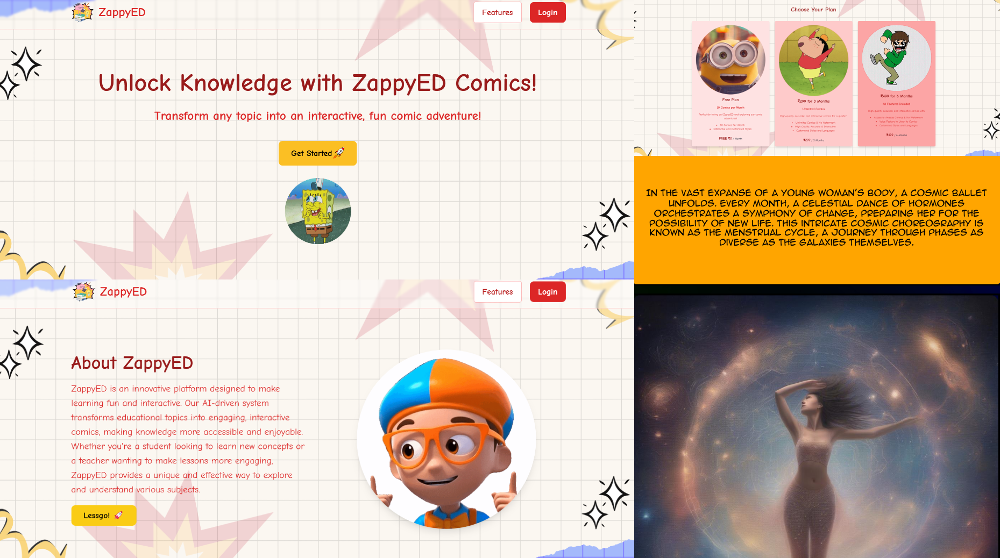

## 🌟 **ZappyED** - Empowering Learning Through Visual Storytelling 🌟

### 📌 Problem Statement
In today's fast-paced world, students often face challenges with short attention spans. This makes it difficult to stay focused on academic subjects or complex societal topics, such as menstruation, superstitions, or sex education. Studies reveal that **65% of people are visual learners**, and traditional text-based learning presents limitations like:

- ⚠️ **Difficulty in Conceptualization**
- 📉 **Reduced Retention**
- 🚫 **Limited Engagement**
- ❗️ **Difficulty in Problem-Solving**
- 🧠 **Increased Cognitive Load**
- 🎨 **Limited Creativity and Expression**

 

### 💡 Solution
**ZappyED** is an **AI-powered platform** that transforms textual content—especially on complex or taboo topics—into **visually engaging comics or manga**. By leveraging generative AI and advanced text-to-image transformation, ZappyED provides an immersive learning experience that enhances retention and engagement.

---

## 🌠 Core Features

### 🎨 **Text-to-Comic Transformation**
   - 📖 Users can enter any topic or storyline, and the platform will convert it into a comic or manga in chosen styles (e.g., Marvel, DC, Anime).
   - 🖌️ Uses **Stable Diffusion** for high-quality, real-time comic generation, enabling students to access visually engaging content quickly.

### 🚀 **Fast Comic Generation Pipeline**
   - ⚡ Comics generated in **30-50 seconds**.
   - 🧩 Optimized for a smooth user experience, allowing students to access visually enriched content instantly.

### 🎙️ **Voice Narration**
   - 🗣️ Each comic panel has interactive narration, making it easier to follow along and retain information—especially for auditory learners.

### ❓ **AI-Generated Quiz**
   - 📚 After reading, users can take a quick, AI-generated quiz to reinforce understanding and retention.

### 🤝 **Co-Lab and Learn**
   - 💡 Collaborative learning spaces where students can co-create comics, share ideas, and engage in peer reviews, enhancing creativity and critical thinking.

### 💬 **Interactive Chatbot with Comic Characters**
   - 📱 Students can interact with comic characters, allowing for a fun and engaging learning experience as they ask questions and get responses in character voices.

### 🕶️ **AR Integration**
   - 🧑‍🎤 Augmented Reality allows students to interact with comic scenes, creating an immersive bridge between physical and digital learning environments.

### 🧠 **Adaptive Learning Paths**
   - 📈 Tailored learning experiences adjust to each student’s performance and engagement, offering a personalized approach.

### 📚 **LMS Integration**
   - 🖥️ Seamless integration with Learning Management Systems (LMS) for classroom settings, allowing educators to track student progress and engagement.

### 👫 **Classroom Collaboration and Co-Creation Tools**
   - 🌐 Comprehensive tools for group-based learning, allowing students to work together on comic creation and problem-solving.

---

## 🎯 Benefits

- **Enhanced Engagement**: Visually appealing comics help boost interest in complex or sensitive topics.
- **Improved Retention**: The combination of visuals, narration, and quizzes enhances memory and understanding.
- **Reduced Cognitive Load**: Story-driven visuals make content more digestible, easing cognitive stress.
- **Inclusive Learning**: Appealing to various learning styles ensures broader accessibility and inclusivity.

---

## 🔗 Project Resources
- **[Demo Video](https://linktodemo.com)** 📹
- **[Project Idea PDF](https://linktoideapdf.com)** 📄

---

## 🚀 Getting Started

1. **Clone the Repository**: 
   ```bash
   git clone https://github.com/username/ZappyED.git
   ```

2. **Install Dependencies**: 
   ```bash
   npm install
   ```

3. **Run the Application**:
   ```bash
   npm start
   ```

4. **Explore the Features**: Enter storylines, generate comics, or take an AI quiz on your topic!

---

## 🛠 Tech Stack

- **Frontend**: React, Tailwind CSS
- **Backend**: Node.js, Express
- **Machine Learning & GenAI**:
  - **Hugging Face Inference API**
  - **Text-to-Image & Image-to-Text** technologies
  - **LLMs (Large Language Models)**, **NLMs (Neural Language Models)**
  - **LangChain for conversational AI**
  - **Python** for ML integration
  - **Jupyter Notebook** for data analysis and prototyping

